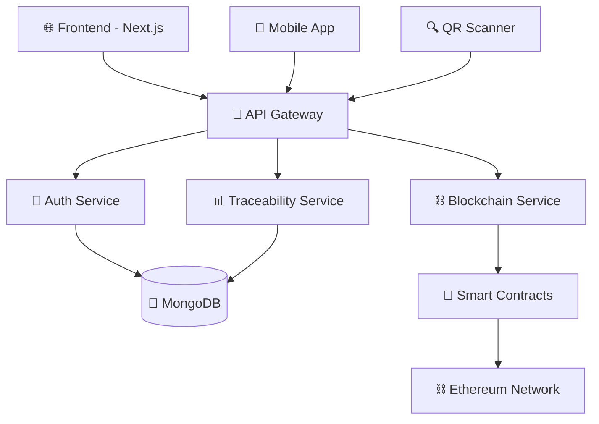

# 🥗 FoodTrace - Food Traceability System

<div align="center">
  
</div>

<div align="center">
  
</div>

---

<div align="center">

### 🚀 **Tech Stack Showcase**

</div>

<p align="center">
  
</p>

<div align="center">
  
  
  
  
  
  
</div>

<div align="center">
  
  
  
  
  
</div>

---

<div align="center">
  
</div>

## 🌟 **About FoodTrace**

<div align="center">
  
</div>

**FoodTrace** is a cutting-edge food traceability system that revolutionizes supply chain transparency through blockchain technology. Our platform ensures food safety, authenticity, and complete traceability from farm to fork.

<div align="center">
  
</div>

---

## ✨ **Key Features**

<table align="center">
<tr>
<td width="50%">

### 🔍 **Real-time Traceability**
- Track products through entire supply chain
- Instant access to product history
- Live location and status updates

### 🔐 **Blockchain Security**
- Immutable transaction records
- Smart contract automation
- Decentralized data storage

### 📱 **QR Code Integration**
- Quick product information access
- Mobile-friendly scanning
- Instant verification system

</td>
<td width="50%">

### 📊 **Advanced Analytics**
- Comprehensive dashboard
- Real-time reporting
- Supply chain insights

### 🌐 **Web3 Integration**
- Secure cryptocurrency transactions
- Wallet connectivity
- DeFi protocol support

### 📱 **Responsive Design**
- Cross-platform compatibility
- Modern UI/UX design
- Progressive Web App features

</td>
</tr>
</table>

<div align="center">
  
</div>

---

## 🏗️ **Project Architecture**

<div align="center">
  
</div>



<details>
<summary>📁 <strong>Detailed Project Structure</strong></summary>

```
foodtrace/
├── 🎨 frontend/                    # Next.js React Application
│   ├── 📂 src/
│   │   ├── 🧩 components/         # Reusable UI components
│   │   ├── 📄 pages/              # Application pages
│   │   ├── 🎨 styles/             # CSS and styling
│   │   ├── 🛠️ utils/              # Utility functions
│   │   └── 🔗 hooks/              # Custom React hooks
│   ├── 📁 public/                 # Static assets
│   └── ⚙️ config files
│
├── 🚀 backend/                     # Node.js Express Server
│   ├── 📂 src/
│   │   ├── 🛣️ routes/             # API route definitions
│   │   ├── 🎮 controllers/        # Business logic handlers
│   │   ├── 📊 models/             # Database models
│   │   ├── 🔐 middleware/         # Authentication & validation
│   │   └── 🛠️ services/           # Business services
│   └── ⚙️ config files
│
└── ⛓️ blockchain/                  # Smart Contracts & Web3
    ├── 📜 contracts/              # Solidity smart contracts
    ├── 🧪 test/                   # Contract tests
    ├── 📋 scripts/                # Deployment scripts
    └── ⚙️ config files
```

</details>

---

## 🛠️ **Technology Deep Dive**

<div align="center">
  
</div>

### 🎨 **Frontend Powerhouse**

<table align="center">
<tr>
<td align="center" width="20%">
  
  <br><strong>Next.js 14</strong>
  <br>SSR & Performance
</td>
<td align="center" width="20%">
  
  <br><strong>React 18</strong>
  <br>Modern Hooks
</td>
<td align="center" width="20%">
  
  <br><strong>TypeScript</strong>
  <br>Type Safety
</td>
<td align="center" width="20%">
  
  <br><strong>Material-UI</strong>
  <br>Premium Design
</td>
<td align="center" width="20%">
  
  <br><strong>Web3</strong>
  <br>Blockchain Integration
</td>
</tr>
</table>

### 🚀 **Backend Excellence**

<table align="center">
<tr>
<td align="center" width="25%">
  
  <br><strong>Node.js</strong>
  <br>Runtime Environment
</td>
<td align="center" width="25%">
  
  <br><strong>Express.js</strong>
  <br>Web Framework
</td>
<td align="center" width="25%">
  
  <br><strong>MongoDB</strong>
  <br>NoSQL Database
</td>
<td align="center" width="25%">
  
  <br><strong>JWT</strong>
  <br>Authentication
</td>
</tr>
</table>

### ⛓️ **Blockchain Infrastructure**

<table align="center">
<tr>
<td align="center" width="25%">
  
  <br><strong>Solidity</strong>
  <br>Smart Contracts
</td>
<td align="center" width="25%">
  
  <br><strong>Truffle</strong>
  <br>Development Suite
</td>
<td align="center" width="25%">
  
  <br><strong>Hardhat</strong>
  <br>Testing Framework
</td>
<td align="center" width="25%">
  
  <br><strong>Ethereum</strong>
  <br>Blockchain Network
</td>
</tr>
</table>

---

## 🚀 **Quick Start Guide**

<div align="center">
  
</div>

### 📋 **Prerequisites**

<div align="center">

| Requirement | Version | Status |
|-------------|---------|--------|
| Node.js | >= 14.x | ✅ Required |
| npm/yarn | Latest | ✅ Required |
| Git | Latest | ✅ Required |
| Ganache | Latest | 🔧 Development |

</div>

### 📥 **Installation**

<details>
<summary>🔽 <strong>Step-by-step Installation</strong></summary>

#### 1️⃣ **Clone Repository**
```bash
git clone https://github.com/your-username/foodtrace.git
cd foodtrace
```

#### 2️⃣ **Install Frontend Dependencies**
```bash
cd frontend
npm install
```

#### 3️⃣ **Install Backend Dependencies**
```bash
cd ../backend
npm install
```

#### 4️⃣ **Install Blockchain Dependencies**
```bash
cd ../blockchain
npm install
```

</details>

### 🏃‍♂️ **Running the Application**

<div align="center">
  
</div>

```bash
# Create MongoDB environment by using Docker
docker pull mongo:latest
docker run -d -p 27017:27017 --name foodtrace mongo:latest
```

```bash
# ⛓️ Deploy Smart Contracts (Terminal 1)
# open ganache and get private_key
 => cd blockchain
 => python deploy.py (add private_key)
 => python app.py

# 🔥 Start Backend (Terminal 2)
cd backend
npm start

# 🚀 Start Frontend (Terminal 3)
cd frontend
npm start
```

#### Using

- Visit the homepage: [http://localhost:3000](http://localhost:3000)  
  👉 This page allows users to **scan QR codes** via camera or **upload QR images**.

- Access the admin dashboard at: [http://localhost:3000/admin](http://localhost:3000/admin)  
  👉 Reserved for **admin accounts** with the following credentials:
  * **Email:** `admin@gmail.com`  
  * **Password:** `admin123`
  * Features available:
    - Manage supplier accounts  
    - Create new supplier accounts  

- Experience the **supplier dashboard**:
  👉 Please login a supplier account at [http://localhost:3000/login](http://localhost:3000/login)  
  👉 Once logged in, you will be redirected to the **Dashboard**, where you can:
  * Add new products  
  * Update product status and quality

---

## 🤝 **Contributing**

<div align="center">
  
</div>

<div align="center">
  
</div>

This project was collaboratively built by our team of 5 developers, each bringing unique skills and expertise. We welcome contributions from the community to help improve FoodTrace!

### 🎯 **How to Contribute**

1. **🍴 Fork** the repository
2. **🌿 Create** your feature branch (`git checkout -b feature/AmazingFeature`)
3. **📝 Commit** your changes (`git commit -m 'Add some AmazingFeature'`)
4. **🚀 Push** to the branch (`git push origin feature/AmazingFeature`)
5. **🔄 Open** a Pull Request

### 📋 **Contribution Guidelines**

- 🐛 **Bug Reports:** Use our bug report template
- 💡 **Feature Requests:** Use our feature request template
- 📖 **Documentation:** Help improve our docs
- 🧪 **Testing:** Add tests for new features
- 🎨 **UI/UX:** Improve user experience

---

## 👥 **Meet Our Team**

<div align="center">
  
</div>

<div align="center">
  
</div>

<table align="center" width="900px">
<tr>
<td align="center" width="20%">
  
  <br>
  <strong>kuveee</strong>
  <br>
  <sub>🎨 Frontend Specialist</sub>
  <br>
  <sub>React • TypeScript • UI/UX</sub>
  <br>
  <sub>Testing • Deployment</sub>
  <br>
  <a href="https://github.com/kuveee">GitHub</a>
</td>
<td align="center" width="20%">
  
  <br>
  <strong>NTK1100</strong>
  <br>
  <sub>⛓️ Blockchain Developer</sub>
  <br>
  <sub>Solidity • Smart Contracts</sub>
  <br>
  <sub>Testing • Deployment</sub>
  <br>
  <a href="https://github.com/NTK1100">GitHub</a>
</td>
<td align="center" width="20%">
  
  <br>
  <strong>zh13u</strong>
  <br>
  <sub>🔧 Backend Engineer</sub>
  <br>
  <sub>Node.js • MongoDB • APIs</sub>
  <br>
  <sub>Testing • Deployment</sub>
  <br>
  <a href="https://github.com/zh13u">GitHub</a>
</td>
<td align="center" width="20%">
  
  <br>
  <strong>stepToBecomeGigachad</strong>
  <br>
  <sub>⛓️ Blockchain Developer</sub>
  <br>
  <sub>Solidity • Smart Contracts</sub>
  <br>
  <sub>Testing • Deployment</sub>
  <br>
  <a href="https://github.com/stepToBecomeGigachad">GitHub</a>
</td>
<td align="center" width="20%">
  
  <br>
  <strong>Crabs536</strong>
  <br>
  <sub>🔧 Backend Engineer</sub>
  <br>
  <sub>Node.js • MongoDB • APIs</sub>
  <br>
  <sub>Testing • Deployment</sub>
  <br>
  <a href="https://github.com/Crabs536">GitHub</a>
</td>
</tr>
</table>

### 🎯 **Team Roles & Responsibilities**

<div align="center">

| 👨‍💻 **Role** | 🛠️ **Responsibilities** | 🚀 **Technologies** |
|-------------|------------------------|-------------------|
| **Project Lead** | Architecture, Coordination, Full-Stack Development | Next.js, React, Node.js, Project Management |
| **Blockchain Dev** | Smart Contracts, Web3 Integration, DApp Logic | Solidity, Truffle, Hardhat, Ethereum |
| **Frontend Specialist** | UI/UX Design, Component Development, Responsive Design | React, TypeScript, Material-UI, CSS |
| **Backend Engineer** | API Development, Database Design, Server Logic | Node.js, Express, MongoDB, RESTful APIs |
| **Security & DevOps** | Authentication, Testing, CI/CD, Deployment | JWT, Testing Frameworks, Docker, AWS |

</div>

<div align="center">
  
</div>

---

## 🙏 **Acknowledgments**

<div align="center">
  
</div>

Special thanks to all the amazing technologies, communities, and our team collaboration that made this project possible:

### 🎓 **Educational Support**

<div align="center">
  
</div>

<table align="center" width="100%">
<tr>
<td align="center" width="33%">
  
  <br>
  <strong>🏫 ACADEMIC INSTITUTION</strong>
  <br>
  <sub><strong>Posts and Telecommunications Institute of Technology</strong></sub>
  <br>
  <sub><strong>Ho Chi Minh City Campus</strong></sub>
  <br>
  <sub>🎯 Exceptional academic resources</sub>
  <br>
  <sub>🚀 Innovation in technology education</sub>
</td>
<td align="center" width="33%">
  
  <br>
  <strong>👨‍🏫 FACULTY MENTOR</strong>
  <br>
  <sub><strong>Mr. Chau Van Van, MSc</strong></sub>
  <br>
  <sub><em>Project Supervisor & Technical Advisor</em></sub>
  <br><br>
  <sub>🎓 Exceptional mentorship</sub>
  <br>
  <sub>💡 Technical guidance & expertise</sub>
  <br>
  <sub>🛠️ Modern software development practices</sub>
</td>
<td align="center" width="33%">
  
  <br>
  <strong>📚 COURSE FOUNDATION</strong>
  <br>
  <sub><strong>INTRODUCTION TO SOFTWARE ENGINEERING (SWE)</strong></sub>
  <br>
  <sub><em>Comprehensive Academic Program</em></sub>
  <br><br>
  <sub>📖 Comprehensive curriculum</sub>
  <br>
  <sub>🔬 Hands-on learning experiences</sub>
  <br>
  <sub>⚙️ Software engineering principles</sub>
</td>
</tr>
</table>

<div align="center">
  
  
  
</div>

### 🌟 **Technology Communities**
- ⚡ **Vercel Team** for Next.js framework
- ⚛️ **React Team** for the amazing library
- ⛓️ **Ethereum Foundation** for blockchain technology
- 🎨 **Material-UI Team** for beautiful components
- 🚀 **Open Source Community** for countless resources

### 👥 **Team Collaboration**
- 💪 **Each team member** for their dedicated contributions
- 🤝 **Collaborative spirit** that made this project successful
- 🧠 **Knowledge sharing** between team members
- ⏰ **Time management** and meeting deadlines together

### 🔧 **Development Tools**
- 🐙 **GitHub** for version control and collaboration
- 💬 **Discord/Slack** for team communication
- 📋 **Trello/Notion** for project management
- ☕ **Coffee & Late nights** that powered our coding sessions


<div align="center">
  
</div>


<div align="center">
  <sub>Built with ❤️ by the FoodTrace team</sub>
</div>
